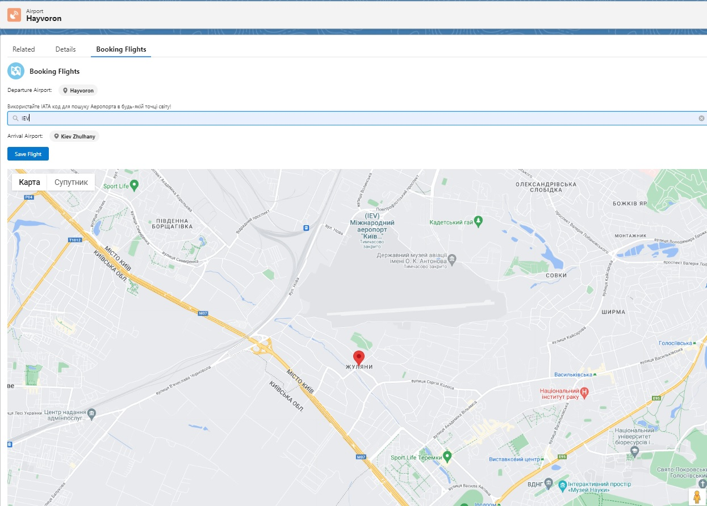

The Booking Flights App is a final project assignment that showcases the skills and knowledge of both server-side logic in Apex and UI frameworks, specifically Lightning Web Components (LWC). The app is designed to fulfill a business request from a flight booking company called "Force Airlines." It is implemented within the Salesforce platform and aims to provide a user-friendly interface for company operators to search for airports by IATA code, view destination points on a map, and book flights. The project focuses on optimizing code, maintaining coding quality, adhering to best practices, and demonstrating a strong understanding of problem-solving and decision-making skills.

# lwc-booking-flights
